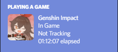
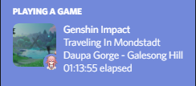
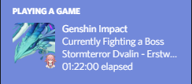
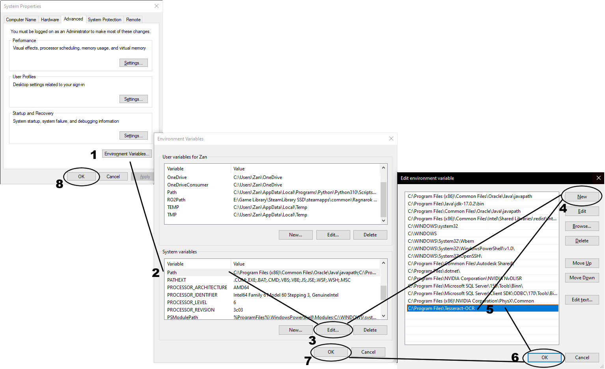

# Genshin Impact Rich Presence - work in progress

Only works on english text and works best when traveling from a place to another instead of teleporting to it since it gives time for the app to read the place title you are in best

also check the tutorial.txt

<p>
A proof of concept Rich Presence, works most of the time for characters but struggles sometimes when knowing where you are,
might be a bit laggy if you dont have a good pc, also only works well in 1080p fullscreen displays might fix it if i find a way to do so

This Discord Rich Presence doesnt tamper with Genshin Impact in any way aside from taking screenshots from the game and using tesseract to turn the images into text usable for code for the rich presence

all the image assets Belong to Genshin Impact and Mihoyo/Hoyoverse, some taken from the Genshin Impact wiki https://genshin-impact.fandom.com/ and others screenshots from the game by me.

</p>





## Before Using

Tesseract is needed to run the image to text algorithm so needs to be installed before trying it

- [`Tesseract`](https://digi.bib.uni-mannheim.de/tesseract/?C=M;O=A) == [5.0.1](https://digi.bib.uni-mannheim.de/tesseract/tesseract-ocr-w64-setup-v5.0.1.20220118.exe) (To scan the images for texts)

In order to complete the installation of `Tesseract`, make sure it is run-able from the Command Prompt (visible from the Windows `PATH` environment variable):

```cmd
tesseract
```

If it is not detected, add your installation folder to the Windows `PATH` variable.


in windows 10 open settings, go to system, go to about then press advanced system settings on the right side

or

press the windows key and type path on the search bar and open edit the system environment and variables

should give you something like this 



press environment variables on the bottom of the first window

on system variables scroll until you see Path and while selected press Edit

Press on new and copy paste the installation folder of Tesseract that you installed a bit ago, default should be C:\Program Files\Tesseract-OCR

then press ok and ok and ok

## Acknowledgement

Thanks to [Kxnrl](https://github.com/Kxnrl) and [parampaa2](https://github.com/parampaa2)  for the idea of rich presence with tesseract

Thanks to [Kataiser](https://github.com/Kataiser) too for the base code that i used on this rich presence

## Known Issues

its not accurate at times and reads the names of the map too when you check on it

## ToDo

make a whitelist so it ignores everything else that isnt the string of text i want it to read, and that would permit the tesseract to be used in full screen instead of 2 boxes though might be a bit cpu intensive, will need to see without it reading and putting everything it sees in your screen into the log

